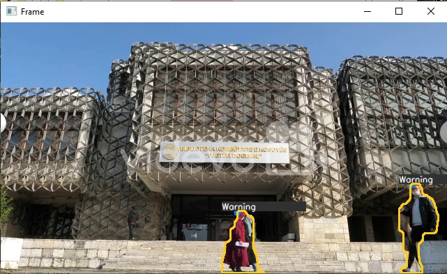

# Social Distance Monitorinng System
> Detect social distancing violation and alert warning

## Table of Contents
- [Social Distance Monitorinng System](#social-distance-monitorinng-system)
  - [Table of Contents](#table-of-contents)
  - [General Information](#general-information)
  - [Technologies Used](#technologies-used)
  - [Features](#features)
  - [Screenshots](#screenshots)
  - [Setup](#setup)
  - [Usage](#usage)
  - [Project Status](#project-status)
  - [Contact](#contact)


## General Information
A project based on detecting social distance and alerting warnings using background
subtraction. This system uses computer vision techniques like background substraction,
object detection, and tracking to monitor the distance between people in a video feed.
When the system detects that the distance between two people is too close, it alerts the
user with a warning message or sound. This is useful in pandemic situations.

## Technologies Used
- Python
- OpenCV


## Features
- Alert warning when social distance is violated


## Screenshots



## Setup
- It is required that python is already installed.


## Usage
```
git clone
cd (directory of repo)
pip install -r requirements.txt
python main.py
```

## Project Status
Project is: _complete_

## Contact
Created by [@EmmanuelSamuel](samuelmayowaemmanuel) - feel free to contact me!
